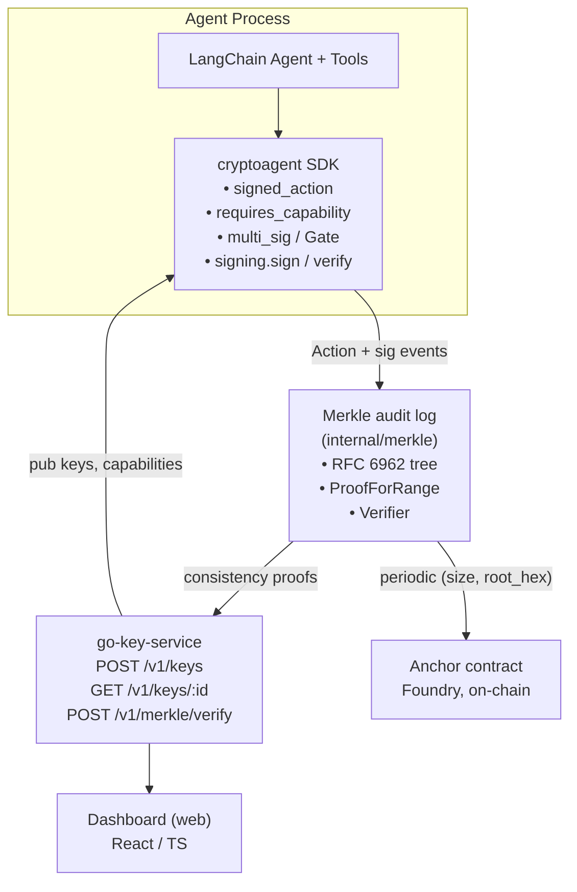

# Architecture

CryptoAgent has four runtime components. Three are first-party
(key-service, SDK, dashboard); the fourth (anchor contract) is a
periodically-invoked Solidity contract on a public chain.

## Components

### `go-key-service`

* **`internal/action`** — canonical Action schema. Authoritative. Both
  the Go signer and the Python SDK marshal identical bytes.
* **`internal/keystore`** — pluggable agent-keypair store (in-memory
  default). HTTP API never returns private keys.
* **`internal/signing`** — Ed25519 sign/verify against canonical bytes.
  Cross-language fixture in `docs/signing_vectors.json`.
* **`internal/merkle`** — append-only RFC 6962 tree with consistency
  proofs and a `Verifier` returning a `VerificationReport` (consistent
  / divergent + hex diagnostic).
* **`internal/httpapi`** — chi-based JSON server for keystore.
* **`internal/merkle/http`** — separate handler for
  `POST /v1/merkle/verify`.
* **`cmd/keyserver`** — wires config + slog + keystore + httpapi with
  graceful shutdown.
* **`cmd/merkle-verify`** — offline CLI for auditors.

### `sdk-python` (`cryptoagent` package)

* **`action.py`** — Action dataclass mirroring the Go type. Identical
  canonical bytes.
* **`signing.py`** — Ed25519 (PyNaCl) sign/verify. Uses the 32-byte
  Ed25519 *seed*, which round-trips with Go's
  `ed25519.NewKeyFromSeed`.
* **`acl.py`** — capability ACL.
* **`multisig.py`** — `Gate` (t-of-n threshold + bypass metrics) and
  `gated` invariant decorator.
* **`decorators.py`** — `@signed_action`, `@requires_capability`,
  `@multi_sig` plus `current_signed_action()` for downstream verifiers.
* **`langchain_integration.py`** — `signed_tool(...)` builder that
  returns a `langchain_core.tools.Tool` whose underlying func is
  fully wrapped.

### Dashboard

React/TypeScript SPA that visualizes the Merkle tree and recent agent
interactions. Reads from the key-service over HTTP. Writes nothing.

### Anchor contract (`contracts/`)

Foundry contract that accepts periodic `(size, root)` commits from a
trusted committer. The root-consistency job re-runs RFC 6962 consistency
between the live tree and on-chain commits to detect rewrites.

## Data flow for a critical action

1. Agent code calls a function decorated with `@signed_action`.
2. Decorator builds a canonical Action (current ms, fresh nonce) and
   signs it with the agent's private key (loaded from key-service or
   a local secret).
3. `@requires_capability` checks the ACL by `agent_id`; missing
   capability → `CapabilityError`.
4. Co-approvers (or a quorum service) sign the same canonical bytes.
5. Caller invokes `gate.execute(action, signatures, fn, ...)`. The gate
   verifies each signature, counts unique valid signers, compares to
   the threshold, and only then runs `fn`.
6. The signed action and its signature are appended to the Merkle audit
   log (`canonical(action) || signature` → `HashLeaf`).
7. Periodically, `(size, root)` is committed on-chain via the anchor
   contract. Auditors run `merkle-verify` (or `POST /v1/merkle/verify`)
   to confirm the live tree extends every committed root.

## Deployment notes

* **Stateless components**: key-service handlers themselves are
  stateless; persistence lives behind the `keystore.KeyStore`
  interface. The in-memory impl is for dev/CI only — production should
  back it with a file-encrypted KMS or an HSM-backed signer.
* **Replay window** (per `docs/schema.md`): verifiers reject actions
  with `|now - timestamp| > 30s` and remember `(agent_id, nonce)` for
  ≥ 630s.
* **Gate bypass metric** is per-process. To aggregate across replicas,
  scrape `gate.bypass_metrics()` into Prometheus or a sink of choice.
* **Merkle log**: today the live tree is in-process. Production
  deployment should persist leaf hashes durably and reload on start;
  the consistency proof verifier already supports rebuilding from a
  hex leaves file.
* **On-chain anchoring** is out of scope for the SDK — the contract
  is just the receiver. The committer (a small daemon, not yet
  shipped) decides cadence (e.g. every 10 minutes).

## Versioning

All canonical-bytes changes bump `SchemaVersion` (see
`docs/schema.md`). The runtime libraries reject mismatched versions;
upgrade order is signers first, then verifiers.
